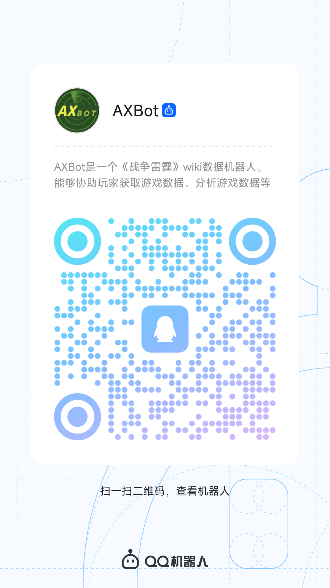

# 首页

欢迎使用 AXBot QQ 机器人！本文档将为您介绍 AXBot 机器人的基本信息，以及如何使用 AXBot 机器人。

## 什么是 AXBot

AXBot 是一个专注于 《战争雷霆》 游戏数据的 QQ 机器人，能够协助用户展示并分析玩家的**公开**游戏数据、获取并展示游戏内资产数据等。

AXBot 的主要功能包括：

- 战雷玩家基本战绩的查询
- 战雷玩家个别载具数据的查询
- 战雷玩家载具数据的整体分析
- 载具车辆数据的查询
- 战雷梗图
- QQ群级别的细粒度管理

### 谁开发的 AXBot

AXBot 最早是由个人（B 站 UP 主 摸鱼又开摆的三三，下文简称三三）主导开发，一些国际社区内的热心游戏玩家开发者协助开发的第三方机器人。**请注意，AXBot 机器人不归属于 Gaijin 及其相关实体**

[跳转到三三的B 站首页](https://space.bilibili.com/8696650){ .md-button }

尽管三三本人独立完成了 AXBot 的大部分开发，但是 AXBot 的成功依然离不开其他的一些热心开发者的协助，他们是战雷社区中的优秀开发者，因为一些巧合我们相识并合作，在此特别感谢他们的帮助。

#### 归属权的变更

由于三三开发 AXBot 的初衷是为了让自己能有更多的粉丝从而成为认证主播，这一目标在经年累月的实践中发现不大现实，因此在2025年6月左右，AXBot 计划转交给一个新的非盈利团队进行维护和开发。

尽管从个人 SOLO 转成了团队作战，但三三本人依然主导和参与着 AXBot 的开发和维护工作。因此，AXBot 归属权的变更仅意味着冠名发生变更，暂不会对普通用户有其他影响。

#### 团队现状

目前AXBot由一个小型团队进行开发。根据团队中每个人的个人意愿，我们会不定期的进行团队人员配置上的调整。

> 请放心，我们都是严选雷批，做的功能还是会切合大家的想法和需求，不会像BVVD大人一样不玩自己做的游戏

!!! note "志愿者说明"

    由于机器人的使用较为繁琐，因此AXBot的几个主要群聊中均存在志愿者负责解答问题，他们不属于 AXBot 的开发团队，但会协助解决问题。

## 如何使用 AXBot

AXBot 接入的是 QQ 官方的机器人平台，因此只需要使用手机 QQ 扫描下面的二维码，即可将 AXBot 添加到 QQ 群中。

!!! note "注意事项"

    部分群聊关闭了“允许群成员邀请机器人加群” 的设置，或者设置了机器人加群需要审核，此时请让群主或者管理员邀请 AXBot 加入群聊。

当然，你也可以直接加AXBot的QQ号：**2854210995**

## 关于数据的说明

AXBot 作为一个数据机器人，其数据来源于多种渠道。包括但不限于：

- 玩家个人数据来自 Gaijin 官方提供的公开数据，从 WT Assistant APP / 游戏客户端 中获取
- 载具数据来自开源拆包库 [https://github.com/gszabi99/War-Thunder-Datamine](https://github.com/gszabi99/War-Thunder-Datamine)
- WIKI 数据来自 [战争雷霆 WIKI 中文站](https://wiki.biligame.com/warthunder)
- 战雷梗图来源于网络，由网友提供并在群中审核，收集，上传

!!! info "数据归属权说明"

    AXBot使用的所有第三方数据/图片/模型等资产的归属权均归原作者所有，AXBot 仅对数据进行了二次处理和展示。

    如果您是原作者，并对 AXBot 使用您的数据存在异议，请联系开发者，我们会尽快处理。

    - 电子邮箱：[axiangcoding@gmail.com](mailto:axiangcoding@gmail.com){ .md-button }

如果您关注的是数据的含义，请参阅 [数据介绍](./data-intro/wt-player-data.md) 章节。
