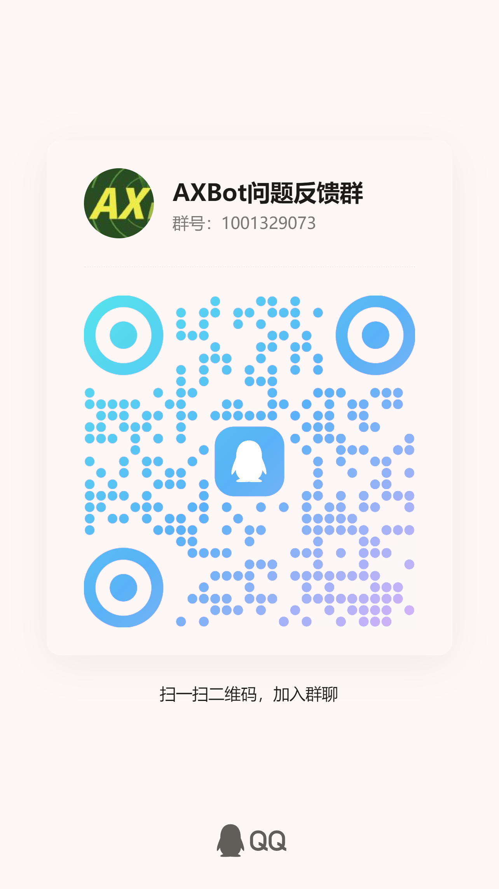

# 反馈和建议

## 举报滥用

AXBot及其开发者团队坚决反对任何形式的滥用行为，包括但不限于：

- 以任何形式诱导机器人进行违法违规操作。
- 以任何形式诱导机器人进行人身攻击。
- 以任何形式诱导机器人进行违反道德底线的行为。
- 机器人因第三方数据源的问题而导致输出不恰当的内容。

如果发现有人滥用 AXBot，或者AXBot自身输出了不合时宜的内容，请立即向开发者举报。开发者会在第一时间进行处理。

根据平台规则，AXBot设立统一的举报渠道，即发送邮件到 <axiangcoding@gmail.com> 中。请在邮件中描述清楚举报的内容，必要时提供截图，并告知群组的OpenID或者滥用者的OpenID（如果你能知道的话）。

!!! tip "如何获得群组的OpenID"

    在 QQ 群中，可以通过命令 `@AXBot /群状态` 获得群组的OpenID

## 问题反馈

如果你在使用中遇到了任何问题，请在遵循提问的艺术的前提下，向开发者反馈问题。开发者或者其他使用者会尽力帮助你解决问题。

### 提问的艺术

在向开发者或者其他使用者提问时，请务必明确以下几点：

1. 提问时，请务必描述清楚问题。你的输入是什么样的，你期望的结果是什么样的，实际结果是什么样的。描述问题时如果有截图更佳，复杂的问题建议录屏。比如：

    > 我在群里输入了 `@AXBot /战雷战绩 xxx`，但是我没有得到正常的回应，而是得到了 `BusinessError: xxx`的结果。

2. 开发者没有义务回答任何问题，但是开发者和其他使用者都会尽力帮助你解决问题。所以请不要使用刻薄甚至恶毒的语言来强调问题的紧迫性。
3. 开发者也有自己的个人生活，不要期望开发者能够立刻回复你的问题。如果你的问题长时间得不到响应，建议间隔一段时间再次提问。
4. AXBot 有自己的开发计划和路线图，因此不接受任何形式的定制化需求以及颐指气使的要求。
5. 如果你有好的建议，欢迎提出，我们会酌情考虑。

### 反馈渠道

AXBot 目前接受以下渠道和方式的问题反馈：

- 在 B 站私信 摸鱼又开摆的三三 [跳转到 UP 主的首页](https://space.bilibili.com/8696650){ .md-button }

- 加入 AXBot 问题反馈群

  

## 功能建议

AXBot 有自己的开发计划和路线图，不会因为用户的功能建议而改变开发方向和计划。但是如果你有好的建议，欢迎提出并参与讨论，如果能获得绝大多数人的认可，这类功能建议会被优先采纳并纳入开发计划。

你可以在任何反馈渠道中提出功能建议，开发者会在合适的时机进行讨论。

## 赞助者特权

AXBot 的长期运营离不开赞助者的支持，因此 AXBot 原则上会优先响应赞助者的问题反馈和功能建议。
你可以在 [赞助](./sponsor.md) 页面了解更多关于赞助的信息。
